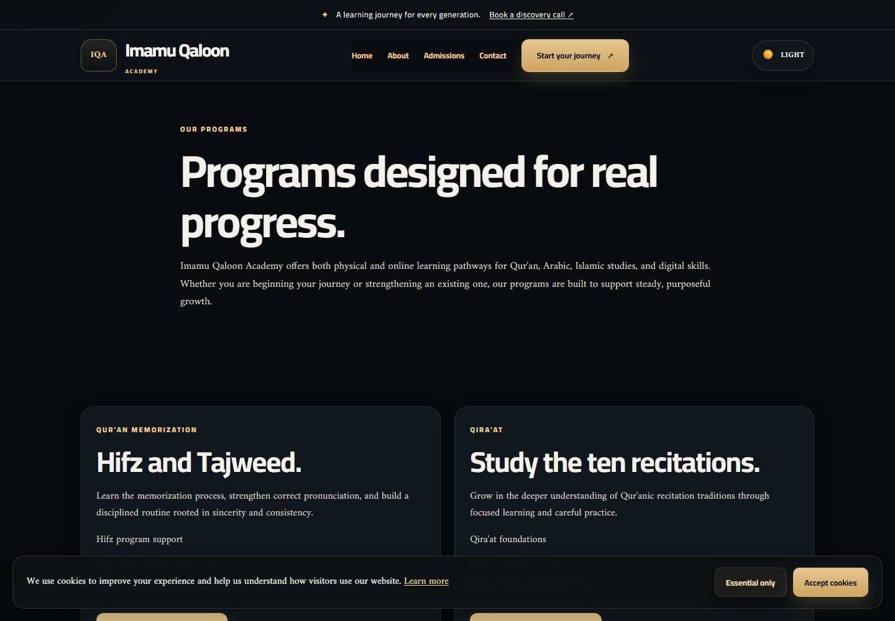
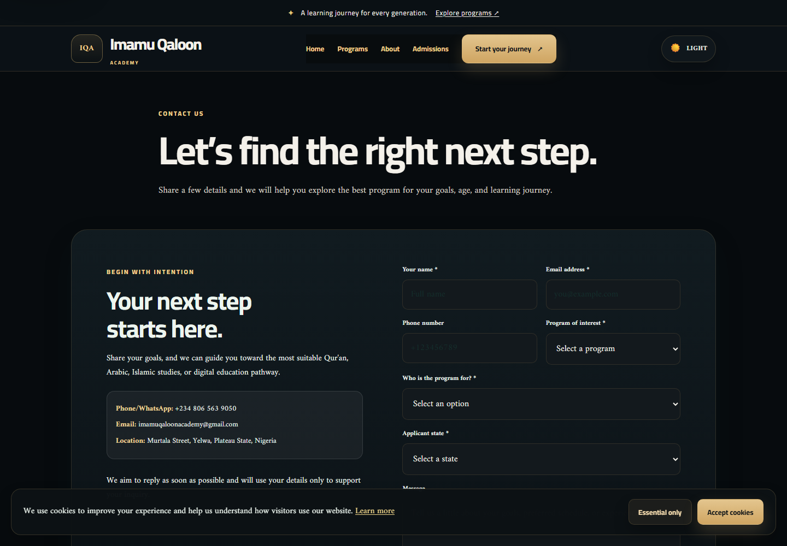
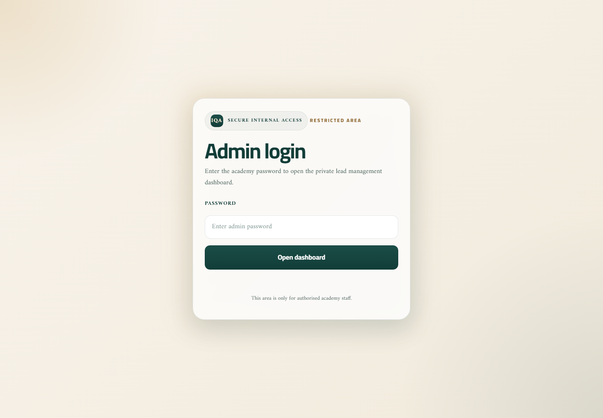

# Imamu Qaloon Academy (IQA)

<p align="center">
  
</p>

<p align="center"><strong>A faith-centered education website with a practical admissions and lead-management workflow.</strong></p>

<p align="center">
  
  
  
  
</p>

## Overview

Imamu Qaloon Academy is a responsive public website for Quran studies, Arabic, Islamic studies, and digital education. It also includes a protected admin portal that turns website inquiries into a lightweight operational CRM.

The platform is built around three outcomes:

- Present the academy’s values and learning pathways clearly.
- Make it easy for prospective students to submit an inquiry.
- Give staff a focused workflow for reviewing, updating, and exporting leads.

## Screenshots

<p align="center">
  
  
</p>
<p align="center">
  
  
</p>

_These screenshots were captured from the running IQA website. The admin capture shows the protected login entry point; no applicant data is included._

## Features

- Responsive multi-page public website
- Premium light and dark theme support
- Admissions and contact forms with server-side validation
- Email notifications through Nodemailer
- WhatsApp handoff for prospective-student follow-up
- Protected admin login with expiring, HttpOnly sessions
- Lead search, filtering, status updates, and deletion
- Applicant state capture with readable IDs such as `IQA-26-0001`
- Automatic dashboard refresh for newly submitted leads
- SQLite persistence with CSV and Excel exports
- SEO essentials: canonical URLs, Open Graph metadata, sitemap, robots, manifest, and 404 page
- Security headers, request-size limits, consent validation, and basic abuse throttling

## Technology

| Area | Technology |
| --- | --- |
| Public interface | HTML, CSS, vanilla JavaScript |
| Application server | Node.js, Express |
| Database | SQLite3 |
| Email | Nodemailer |
| Reporting | ExcelJS |
| Configuration | dotenv |

## Project structure

```text
.
├── public/                 # Public pages, styles, browser scripts, and SEO assets
├── server.js               # Express server, authentication, APIs, and exports
├── data/                   # SQLite database and lead CSV data
├── docs/                   # Product, technical, schema, and architecture docs
├── deploy/                 # Render, Vercel, and Nginx deployment examples
├── .env.example            # Safe configuration template
└── package.json            # Scripts and dependencies
```

## Local development

### Requirements

- Node.js 20 or newer
- npm
- SMTP credentials if email notifications are required

### Setup

```bash
npm install
copy .env.example .env
npm run check
npm run dev
```

On macOS/Linux, use `cp .env.example .env` instead of `copy`.

Then open [http://localhost:3001](http://localhost:3000). The admin entry point is available at `/admin-login`.

For a production-style start:

```bash
npm start
```

The SQLite database is created automatically at `data/noor_academy.db` when the server first starts.

## GitHub publishing

The repository intentionally ignores `.env`, `node_modules`, and local lead data under `data/`. Review `git status` before the first push and confirm that no credentials or applicant records are staged.

## Configuration

Copy `.env.example` to `.env` and set real values. Never commit `.env` or expose credentials in public assets.

| Variable | Purpose |
| --- | --- |
| `PORT` | HTTP port; defaults to `3000` |
| `ADMIN_PASSWORD` | Required password for the admin portal |
| `NODE_ENV` | Use `production` when deployed behind HTTPS |
| `SMTP_HOST` | SMTP server hostname |
| `SMTP_PORT` | SMTP server port, usually `587` or `465` |
| `SMTP_USER` | SMTP account username |
| `SMTP_PASS` | SMTP account password or app password |
| `SMTP_FROM` | Sender identity for inquiry notifications |
| `EMAIL_TO` | Academy inbox that receives inquiries |
| `WHATSAPP_NUMBER` | WhatsApp number in international format without `+` |

Email delivery is optional for local development; inquiries are still saved to SQLite when SMTP is unavailable.

## API surface

| Method | Route | Access | Purpose |
| --- | --- | --- | --- |
| `GET` | `/api/health` | Public | Service health check |
| `POST` | `/api/contact` | Public | Validate and save an inquiry |
| `GET` | `/api/leads` | Admin | List leads ordered by creation time |
| `PATCH` | `/api/leads/:id` | Admin | Update lead details or status |
| `DELETE` | `/api/leads/:id` | Admin | Delete a lead |
| `GET` | `/api/leads.csv` | Admin | Download CSV export |
| `GET` | `/api/leads.xlsx` | Admin | Download formatted Excel report |

Lead timestamps are stored as ISO 8601 UTC values and displayed in the admin dashboard using the operator’s local timezone.

## Documentation

- [Documentation index](docs/README.md)
- [Product requirements](docs/PRD.md)
- [Technical requirements](docs/TRD.md)
- [Backend schema](docs/Backend-Schema.md)
- [Architecture](docs/Architecture.md)
- [Project Bible — portfolio and technical showcase](docs/PROJECT-BIBLE.md)
- [Sitemap](public/sitemap.xml)

## Deployment notes

- Set every secret through the hosting provider’s environment configuration.
- Use HTTPS in production so secure admin cookies are enabled.
- Use a persistent disk for SQLite. Vercel’s serverless filesystem and ephemeral hosting disks are not suitable for durable lead storage without an external database or persistent volume.
- Configure SMTP before relying on email notifications.
- Update canonical URLs and sitemap entries when the production domain changes.
- Restrict access to exported lead files and treat all lead data as confidential.

## Quality checks

```bash
npm run check
```

The check command validates the server and public browser script syntax. Before launch, also verify the contact flow, admin login/logout, lead updates, exports, email delivery, mobile layouts, and the production health endpoint.

## License

This is a private project for Imamu Qaloon Academy. All rights reserved unless a separate license is provided.
