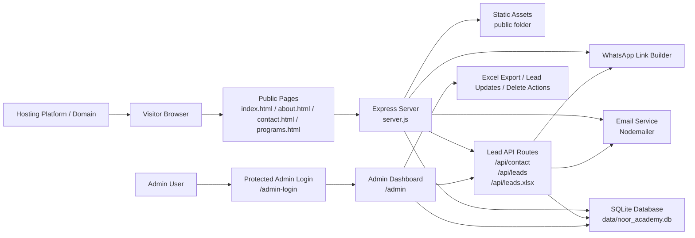

# Project Architecture Diagram

## Architecture summary

The system is organized as a lightweight full-stack app:

- The front-end is served as static content from the `public` directory.
- Express handles routing, admin session protection, and lead APIs.
- SQLite stores all lead records used by the dashboard and exports.
- Nodemailer sends new inquiry alerts to the configured academy inbox.
- ExcelJS generates downloadable lead workbooks for staff follow-up.
- The admin dashboard is only accessible through a protected login flow.

## Key design principles

- Public pages remain lightweight and accessible.
- Admin functionality is isolated behind a secure session.
- Data persistence is local and reliable for a small operational CRM workflow.
- Lead export supports reporting and operational follow-up.
